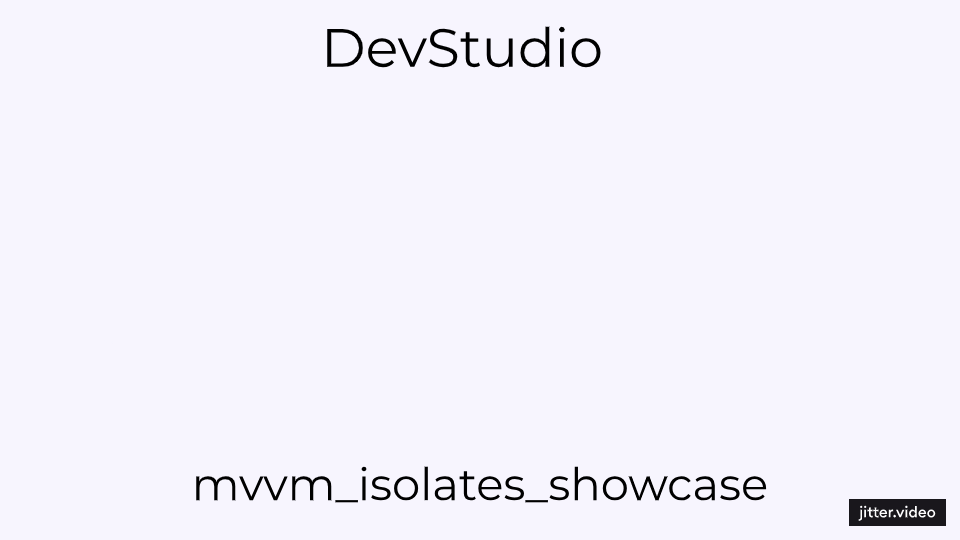

# MVVM + Isolate Example 📱

A Flutter project demonstrating the use of MVVM (Model-View-ViewModel) architecture with Dart isolates for parallel computation and GetX for reactive state management.

## Overview ℹ️

This project showcases how to structure a Flutter application using MVVM architecture, leveraging Dart isolates for performing heavy computations in parallel threads. GetX is used for state management, providing a reactive and efficient way to update the UI based on changes in data.

## 📽 Preview

## Key Features 🚀

- **MVVM Architecture**: Separates UI (View) from business logic (ViewModel) and data (Model), promoting a clean and maintainable codebase.
  
- **Dart Isolates**: Utilizes Dart isolates to perform computationally intensive tasks asynchronously, ensuring smooth UI responsiveness.
  
- **GetX State Management**: Simplifies state management with reactive programming, reducing boilerplate code and enhancing development productivity.

## How This Project Can Help You 🛠️

- **Learning MVVM**: Understand how to organize your Flutter projects using the MVVM architecture pattern, separating concerns and improving scalability.
  
- **Parallel Computation**: Learn how to leverage Dart isolates for executing multiple heavy computations concurrently, maintaining app performance.
  
- **State Management with GetX**: Explore the benefits of using GetX for managing application state, handling reactive updates across different UI components efficiently.

## What You Can Build From This Project 🏗️

This project serves as a foundation for developing Flutter applications that require:

- **Complex Business Logic**: Easily extend the provided examples to handle more sophisticated business logic and data transformations.
  
- **Performance Optimization**: Implement optimizations using Dart isolates for background tasks, enhancing app responsiveness and user experience.
  
- **Scalable Applications**: Build scalable applications by separating UI components from business logic, making maintenance and feature additions straightforward.

## 💡 Contributing

Contributions are welcome! Please create an issue first to discuss what you would like to change.

## 📄 License

This project is licensed under the MIT License.

## About the Developer 🌟

- **👨‍💻Mo'men M.** is passionate about creating efficient and user-friendly mobile applications. With expertise in Flutter and Firebase, Mo'men focuses on delivering robust solutions that enhance user experiences and meet business objectives.
